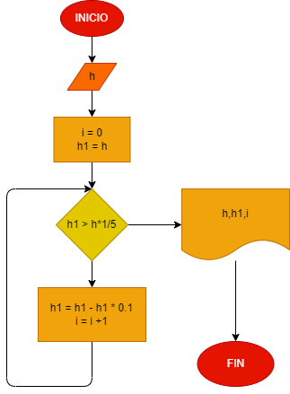

# Una pelota se deja caer desde una altura "h", y en cada rebote sube el -10% del anterior.
# Hacer el diagrama de flujo y el programa en python, que lea "h" y que calcule e imprima en cual rebote la pelota no alcanza a subir la quinta parte de la altura inicial

## Análisis.
 Cada vez que la pelota caiga se le resta el 10% de la altura inicial y se detiene el programa cuando la altura es menor a un quinto de la inicial, imprimiendo la cantidad de rebotes que alcanzo a tener.

## Diagrama de flujo.

